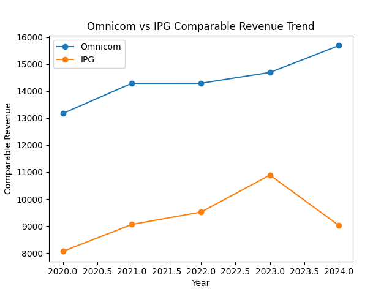
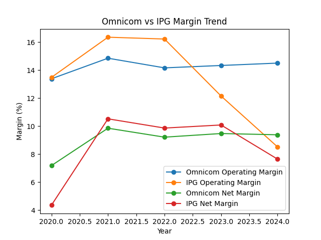
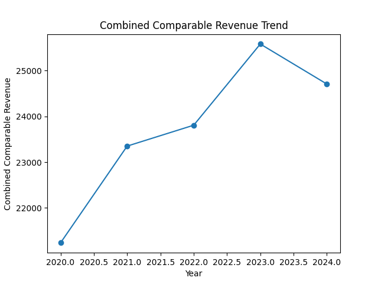

# Omnicom–IPG Merger Financial Analysis

## Project Overview

This project analyzes the financial performance of Omnicom and IPG before their merger.  
The goal is to understand the financial logic behind the merger by comparing comparable revenue trends, profitability margins, and combined comparable revenue scale.

## Business Question

What financial factors may explain the strategic rationale behind Omnicom's acquisition of IPG?

## Data

The dataset includes annual financial data for Omnicom and IPG from 2020 to 2024.

Key variables include:

- Company
- Year
- Comparable Revenue
- Operating Income
- Net Income

## Data Validation Note

The financial figures in this project are currently used as a preliminary dataset for analysis development.  
Before using this project for formal academic or professional purposes, the data should be validated against official annual reports, SEC filings, or company investor relations materials.

For advertising holding companies, revenue definitions may differ across sources.  
Future versions of this project will further clarify whether the analysis uses total revenue, net revenue, or another comparable revenue measure.
## Metrics Analyzed

The project calculates the following financial metrics:

- Operating Margin %
- Net Margin %
- Combined Comparable Revenue

## Tools Used

- Python
- pandas
- matplotlib
- CSV files
- GitHub

## Project Structure

```text
corporate-financial-analytics
├── merger_analysis.py
├── data
│   ├── omnicom_ipg_financials.csv
│   ├── omnicom_ipg_analysis_output.csv
│   └── combined_revenue_output.csv
├── charts
│   ├── omnicom_ipg_revenue_trend.png
│   ├── omnicom_ipg_margin_trend.png
│   └── combined_revenue_trend.png
└── README.md
```

## Visualizations

### Omnicom vs IPG Comparable Revenue Trend



### Omnicom vs IPG Margin Trend



### Combined Comparable Revenue Trend

